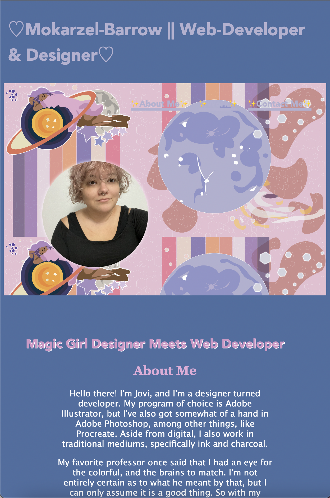
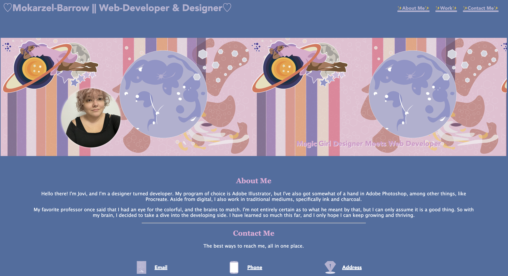

# rolly-portfoli-olly

1.) Screenshots!~

2.) Description
This challenge was particuarly challenging, in more ways than one. I felt challeneged (and determined) to make this as the best I could, as I intend on using this as the backbone of my portfolio, throughout the years. I know it will change, just as I will, but for now, this is a pretty rad set up.

I started full from scratch, starting with a wireframe, before moving on to the bare skeletons, containing a main section, with: a an about me, a contact me, and a work section. Also added was a header with a recent profile image, and a banner that I designed on my own. Also designed by me are the contact icons, and the placeholder images.

From there, it was really just framing the css, as needed and desired.

3.) Credits
My biggest thanks to Joe and William, who put up with all my silly questions, and to those in my classroom or otherwise. 

& to CSStricks for their flexbox-layout tutorials & their media queries guides. Links to:
 https://css-tricks.com/snippets/css/a-guide-to-flexbox/
 https://css-tricks.com/snippets/css/a-guide-to-flexbox/

 Licensing
 
 Standards license apply, but feel free to pull code if need be. Just request before hand.

 Deployed Links:
 https://yond3r.github.io/rolly-portfoli-olly/